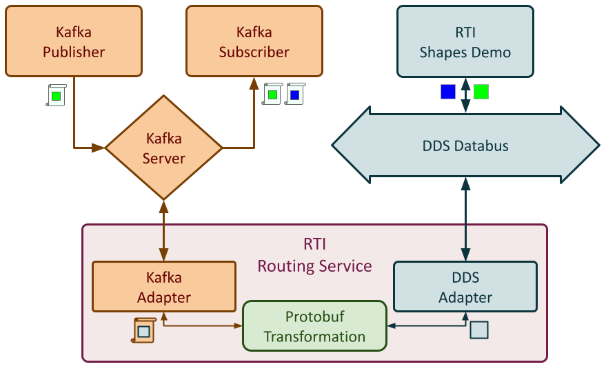

# Kafka-DDS Shapes Demo

Demonstrates bridging RTI Connext DDS shape data to Apache Kafka using RTI
Routing Service with Protocol Buffers serialization. Two run modes are provided:
a fully containerized Docker approach and a native process approach.

## Architecture



RTI Routing Service bridges DDS domain 0 and Kafka. The Kafka publisher and
subscriber are standalone apps that encode and decode shapes using protobuf.
`rtishapesdemo` runs natively on the host in both modes.

---

## Prerequisites

| Requirement | Both modes | Docker only | Native only |
|-------------|-----------|-------------|-------------|
| **RTI Connext DDS Professional 7.x** | Yes | | |
| **rticonnextdds-gateway** (built) | Yes | | |
| **Docker Engine 24+** with Compose plugin | | Yes | |
| **tmux** (optional, for `docker/view.sh`) | | Yes | |
| **Kafka 4.x** local installation | | | Yes |
| **gnome-terminal** | | | Yes |
| Internet access on first `./docker/build.sh` | | Yes | |

### Build rticonnextdds-gateway

Both modes require the gateway to be built. This produces the adapter/plugin
libraries and the `shapes_kafka_publisher` / `shapes_kafka_subscriber` binaries.

**Gateway build prerequisites**

| Requirement | Notes |
|-------------|-------|
| cmake 3.10+ | `cmake --version` |
| Python 3.8+ | Only required to run gateway tests |

Clone with submodules (required for third-party dependencies):

```bash
git clone --recurse-submodule https://github.com/rticommunity/rticonnextdds-gateway.git
cd rticonnextdds-gateway
```

If you already cloned without `--recurse-submodule`, run:

```bash
git submodule update --init --recursive
```

Build and install. The flags below enable the components this demo needs.
Add `-DCMAKE_BUILD_TYPE=Release` to build release artifacts (default is debug):

```bash
mkdir build && cd build
cmake .. \
    -DCONNEXTDDS_DIR=/path/to/rti_connext_dds-7.x.x \
    -DCMAKE_INSTALL_PREFIX=../install \
    -DBUILD_KAFKA_ADAPTER=ON \
    -DBUILD_PROTOBUF_TRANSFORMATION=ON \
    -DBUILD_FIELD_TRANSFORMATION=ON \
    -DCMAKE_BUILD_TYPE=Release
cmake --build . -- install
```

After a successful build the `install/` subdirectory contains:
- `install/lib/` - adapter and transformation `.so` files
- `install/examples/kafka/kafka-shapes-protobuf/bin/` - `shapes_kafka_publisher`
  and `shapes_kafka_subscriber`

---

## Docker Approach

All demo services run in containers. `rtishapesdemo` runs natively on the host.
All containers use `network_mode: host` so RTI Routing Service can participate
in DDS UDP multicast alongside the host.

| Container | Description |
|-----------|-------------|
| `kafka-broker` | Kafka 4.1.1 in KRaft mode (no ZooKeeper) |
| `routing-service` | RTI Routing Service bridging DDS <-> Kafka |
| `kafka-publisher-square` | Publishes GREEN squares to Kafka topic `Square` |
| `kafka-publisher-triangle` | Publishes BLUE triangles to Kafka topic `Triangle` |
| `kafka-subscriber-square` | Subscribes to Kafka topic `Square` |
| `kafka-subscriber-triangle` | Subscribes to Kafka topic `Triangle` |

### Setup

```bash
cd docker/
cp env.example .env
```

Edit `.env`:

```ini
NDDSHOME=/home/<you>/rti_connext_dds-7.7.0
RTI_GATEWAY_HOME=/home/<you>/rticonnextdds-gateway/install
```

Build all images (run once, or after RTI/gateway updates):

```bash
./docker/scripts/build.sh
```

This stages RTI libraries and binaries from your local installation into the
build contexts, copies the shared routing service config from `config/`, and
calls `docker compose build`. The Kafka image downloads the Kafka 4.1.1 tarball
on the first build.

### Run

```bash
./docker/scripts/start.sh
```

This starts all containers and launches `rtishapesdemo` on domain 0.

Watch live logs in a split-pane tmux session:

```bash
./docker/scripts/view.sh
```

| tmux key | Action |
|----------|--------|
| `Ctrl-b n` / `Ctrl-b p` | Next / previous window |
| `Ctrl-b 0`-`3` | Jump to window by number |
| `Ctrl-b w` | Show window list |
| `Ctrl-b d` | Detach (containers keep running) |

Stop:

```bash
./docker/scripts/stop.sh
```

---

## Native Approach

All services run as native processes. Kafka runs from a local installation.

**Additional prerequisite**: download and extract Apache Kafka 4.1.1 before running.

```bash
wget https://archive.apache.org/dist/kafka/4.1.1/kafka_2.13-4.1.1.tgz
tar -xzf kafka_2.13-4.1.1.tgz
```

Point `KAFKA_DIR` in `.env` at the extracted directory.

### Setup

```bash
cd native/
cp env.example .env
```

Edit `.env`:

```ini
NDDSHOME=/home/<you>/rti_connext_dds-7.7.0
RTI_GATEWAY_HOME=/home/<you>/rticonnextdds-gateway/install
KAFKA_DIR=/home/<you>/Downloads/kafka_2.13-4.1.1
```

### Run

```bash
./native/start_demo.sh
```

This starts Kafka, creates the `Square` and `Triangle` topics, launches
`rtishapesdemo`, opens gnome-terminal windows for the Routing Service and each
Kafka publisher and subscriber, and prints a process status table.

Logs are written to `native/logs/`. The Routing Service log is also displayed
live in its gnome-terminal window.

Stop:

```bash
./native/stop_demo.sh
```

---

## Configuration

The Routing Service XML configuration is shared between both approaches:

```
kafka-shapes-demo/config/shapesdemo_kafka_protobuf.xml
```

- **Docker**: `build.sh` copies this file into the routing-service build context.
- **Native**: `start_demo.sh` passes this file to `rtiroutingservice` via `-cfgFile`.

The `shape_type.pbdesc` protobuf descriptor is read from your gateway
installation at runtime in both modes.

---

## Directory Structure

```
kafka-shapes-demo/
├── config/
│   └── shapesdemo_kafka_protobuf.xml   # Shared Routing Service configuration
├── docker/
│   ├── env.example                     # Copy to .env and fill in paths
│   ├── docker-compose.yml
│   ├── scripts/
│   │   ├── build.sh                    # Stages RTI files and builds images
│   │   ├── start.sh / stop.sh / view.sh
│   ├── kafka/                          # Kafka broker image
│   ├── routing-service/                # RTI Routing Service image
│   ├── kafka-publisher/                # Kafka publisher image
│   └── kafka-subscriber/               # Kafka subscriber image
└── native/
    ├── env.example                     # Copy to .env and fill in paths
    ├── start_demo.sh
    └── stop_demo.sh
```

---

## Troubleshooting

| Symptom | Likely cause | Fix |
|---------|-------------|-----|
| Routing Service exits immediately (docker) | Missing `.so` in `routing-service/libs/` | Re-run `./docker/build.sh` |
| No shapes in Shapes Demo after start | Routing Service still initializing | Wait ~10 s; check `native/logs/routing-service.log` or `./docker/view.sh` |
| `kafka-broker` healthcheck keeps failing | JVM slow to start | Increase `start_period` in `docker-compose.yml` |
| DDS data not flowing | Wrong DDS domain | Confirm `rtishapesdemo` is on domain 0 |
| Routing Service log shows `shape_type.pbdesc` error | Working directory wrong | Ensure you are running the scripts from the `kafka-shapes-demo/` directory |
